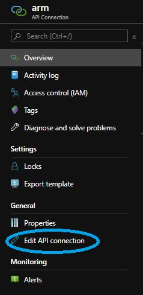

# Clinical Trials Matching Service Blueprint

## Requirements

Clone this repository to your local drive

```Powershell
git clone https://github.com/microsoft/ClinicalTrialsBlueprint
cd ClinicalTrialsBlueprint
```

[Install the Azure PowerShell module](https://docs.microsoft.com/en-us/powershell/azure/install-az-ps?view=azps-3.3.0)

## Connect to Azure Subscription

```PowerShell
Login-AzAccount
$account = Set-AzContext -Subscription <Your Subscription Name>
```

## Setup the FHIR Server

Create a Resource group for the FHIR server. It must be in a separate resource group from other resources in the blueprint becuase we are creating a Windows service plan

```PowerShell
$fhirRg = New-AzResourceGroup -Name <fhir server group name> -Location eastus
```

Assign primary FHIR server Name

```PowerShell
$fhirServerName = "<fhir server name>"
```

Assign secondary FHIR server name

```PowerShell
$fhirSecondaryServerName = "<fhir secondary server name>"
```

Create the FHIR server deployment. You will to provide a admin password for the SQL server

```PowerShell
New-AzResourceGroupDeployment -ResourceGroupName $fhirRg.ResourceGroupName `
                              -TemplateFile .\arm-templates\azuredeploy-fhir.json `
                              -serviceName $fhirServerName
```

Create secondary FHIR server

```PowerShell
New-AzResourceGroupDeployment -ResourceGroupName $fhirRg.ResourceGroupName `
                              -TemplateFile .\arm-templates\azuredeploy-fhir.json `
                              -serviceName $fhirSecondaryServerName
```

Verify that the FHIR Server is running

```PowerShell
$metadataUrl = "https://$fhirServerName.azurewebsites.net/metadata" 
$metadata = Invoke-WebRequest -Uri $metadataUrl
$metadata.RawContent
```

It will take a minute or so for the server to respond the first time.

## Setup the Matching service

Create Resource Group that will contain all the resources required for the blueprint resources

```PowerShell
$rg = New-AzResourceGroup -Name <service Name> -Location eastus
```

Assign a name for the matching service

```Powershell
$ctmServiceName = "<ctm matching service>"
```

Create Logic Applications to manage automatic restructuring (preview)

```Powershell
$logicAppsOutput = New-AzResourceGroupDeployment -ResourceGroupName $rg.ResourceGroupName `
                  -TemplateFile .\arm-templates\azuredeploy-logicapps.json `
                  -serviceName $ctmServiceName -accountId (Get-AzContext).Account.Id
```

Open resource group in azure portal and authorize 2 API connections (arm and office365)




Assign the password of the Docker Container Registry

```Powershell
$acrPassword = ConvertTo-SecureString  -AsPlainText <acr password> -Force
```

Create Primary Clinical Trials Matching service Azure resources

```Powershell
$matchingOutput = New-AzResourceGroupDeployment -TemplateFile .\arm-templates\azuredeploy-ctm.json `
                -ResourceGroupName $rg.ResourceGroupName -serviceName $ctmServiceName `
                -fhirServerName $fhirServerName -fhirSecondaryServerName $fhirSecondaryServerName `
                -acrPassword $acrPassword -finishedNotifyAddress $logicAppsOutput.Outputs.finisherCallbackUrl.Value
```

Stopping primary structuring instance 

```Powershell
. .\scripts\structuring.ps1
```

```Powershell
Stop-CtmStructuring -resourceGroupName $rg.ResourceGroupName -containerGroupName $matchingOutput.Outputs.structuringName.Value
```

Create Secondary Clinical Trials Matching service that will be used as the primary service is being serviced. You need only to pass isSecondary parameter as true

```Powershell
$matchingSecondaryOutput = New-AzResourceGroupDeployment -TemplateFile .\arm-templates\azuredeploy-ctm.json `
                -ResourceGroupName $rg.ResourceGroupName -serviceName $ctmServiceName `
                -acrPassword $acrPassword -finishedNotifyAddress $logicAppsOutput.Outputs.finisherCallbackUrl.Value `
                -isSecondary $true
```

Check that the TextAnalytics for Healthcare service is running and ready

```PowerShell
$taReadyUrl = $matchingOutput.Outputs.gatewayEndpoint.Value + "/ta4h/ready"
$taReadyResponse = Invoke-WebRequest -Uri $taReadyUrl
$taReadyResponse.RawContent
```

Check that the Query Engine Service is running

```PowerShell
$queryUrl = $matchingOutput.Outputs.gatewayEndpoint.Value + "/qe"
$queryResponse = Invoke-WebRequest -Uri $queryUrl
$queryResponse.RawContent
```

Check that the Disqualification Engine Service is running

```PowerShell
$disqualificationUrl = $matchingOutput.Outputs.gatewayEndpoint.Value + "/disq"
$disqualificationResponse = Invoke-WebRequest -Uri $disqualificationUrl
$disqualificationResponse.RawContent
```

### Restrict Access to service

```Powershell
. .\scripts\restrictAccess.ps1
```

```PowerShell
Add-CTMRestrictIPs -resourceGroupName $rg.ResourceGroupName -serviceName $ctmServiceName `
                   -fhirResoureGroupName $fhirRg.ResourceGroupName -fhirServiceName $fhirServerName `
                   -fhirSecondaryServiceName $fhirSecondaryServerName
```

### Setup the Healthcare Bot Service

Assign the Healthcare Bot service name 

```PowerShell
$botServiceName = "<healthcare bot service>"
$secondaryBotServiceName = "<secondary healthcare bot service>"
```

Load the marketplace script

```PowerShell
. .\scripts\marketplace.ps1
```

Create the Healthcare primary and secondary bots Azure Marketplace SaaS Application

```PowerShell
$saasSubscriptionId =  New-HbsSaaSApplication -name $botServiceName -planId free
$secondarySaaSSubscriptionId =  New-HbsSaaSApplication -name $secondaryBotServiceName -planId free
```

You can also see all your existing SaaS applications by running this command. 

```PowerShell
Get-HbsSaaSApplication
```

Deploy a primary Healthcare Bot resources for the Marketplace SaaS application you just created or already had before.

```PowerShell
.\scripts\azuredeploy-healthcarebot.ps1 -ResourceGroup $rg.ResourceGroupName `
                -saasSubscriptionId $saasSubscriptionId  -serviceName $botServiceName `
                -botLocation US -matchingParameters $matchingOutput.Outputs 
```

You can now deploy a secondary Healthcare bot by running this command

```PowerShell
.\scripts\azuredeploy-healthcarebot.ps1 -ResourceGroup $rg.ResourceGroupName `
                -saasSubscriptionId $secondarySaaSSubscriptionId  -serviceName $secondaryBotServiceName `
                -botLocation US -matchingParameters $matchingSecondaryOutput.Outputs
```

### Restructuring Clinical Trials

When you want to update the CMT databases with latest clinical trials from clinicaltrials.gov, you can run the following script

Restart the structuring

```Powershell
Restart-CtmStructuring -resourceGroupName <resource group name> -containerGroupName <structuring container group name>
```

Swap primary and secondary environments

```PowerShell
Switch-AzWebAppSlot -SourceSlotName secondary -DestinationSlotName production `
                    -ResourceGroupName $rg.ResourceGroupName `
                    -Name $matchingOutput.Outputs.gatewayName.Value
 ```
